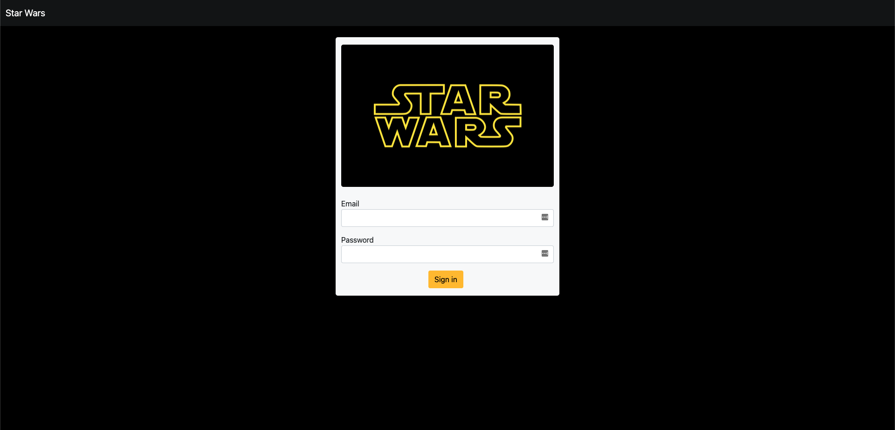

# Star Wars App Tech Test

```A long time ago, in a galaxy far, far away...```

This is an app about Star Wars movies and its characters.

You can see some screenshots of what you will find in it.


### Login


### Films Page


### Film Detail


### Empty Character View


### Character Table


### Character Detail


## Some technical specs

1. PHP 7.4
2. Twig 3
3. MySQL (or MariaDB)

### ERD


### Use of

   1. Client: Used to retrieve data from swapi.dev API
      1. StarWarsClientInterface/StarWarsClient.
   2. Services: Used to contain business logic
      1. CharacterServiceInterface/CharacterService
      2. FilmServiceInterface/FilmService
      3. MailServiceInterface/MailService
   3. Event/Listener: Used to send an email when the user is logged into the app.
      1. UserLoggedInEvent
      2. UserLoggedInListener
   4. Dependency Injection
   5. Some S.O.L.I.D., D.R.Y. and K.I.S.S. principles.

Feel free to leave your comments about what you think about the implementation of the code and how to improve it.